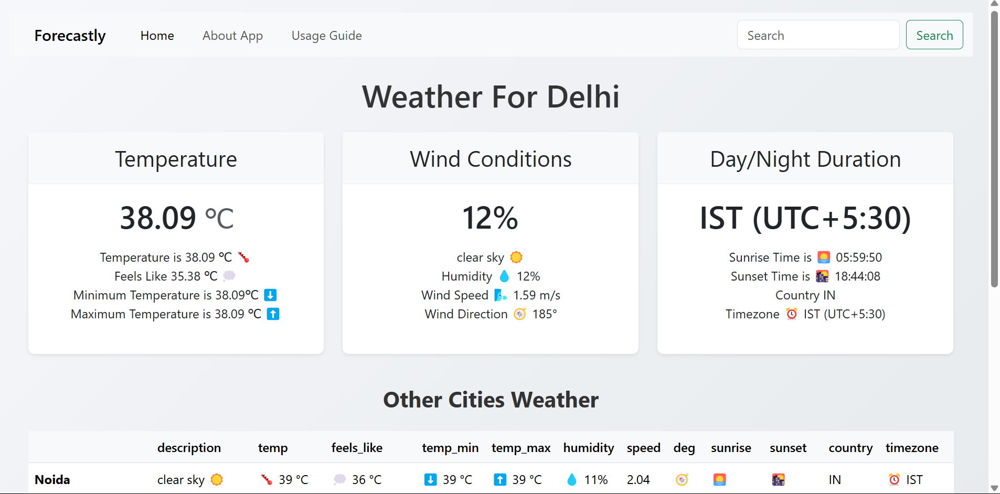

# 🌤️ Forecastly - Real-Time Weather Dashboard

![Forecastly Screenshot]!    [alt text](image-1.png)

A beautiful, responsive weather application that provides real-time weather data for locations worldwide with intuitive visualizations.

## ✨ Features

- **Real-time Weather Data**

  - Current temperature with "feels like" metric
  - Humidity, wind speed/direction
  - Sunrise/sunset times
  - Timezone information

- **Multi-City Comparison**

  - View weather for 5 major Indian cities simultaneously
  - Easy-to-scan comparison table

- **Visual Enhancements**

  - Weather-appropriate emojis (☀️🌧️⛈️)
  - Clean, card-based UI
  - Responsive design works on all devices

- **Helpful Utilities**
  - Detailed "About" section
  - Comprehensive user guide
  - Easy city search

## 🛠️ Technologies Used

- **Frontend**: HTML5, CSS3, JavaScript (ES6+)
- **UI Framework**: Bootstrap 5
- **Weather API**: OpenWeatherMap
- **Icons**: Font Awesome, Emoji
- **Deployment**: GitHub Pages

## 🚀 Getting Started

### Prerequisites

- Modern web browser (Chrome, Firefox, Safari)
- Internet connection

### Installation

1. Clone the repository:
   ```bash
   git clone https://github.com/ShreyaArora31/Forecastly.git
   ```
2. Open `index.html` in your browser.

### Using the App

1. Type a city name in the search bar.
2. Press Enter or click the Search button.
3. View current weather conditions.
4. Scroll down to see other cities' weather.

## 📚 User Guide

Access the full user guide within the app by clicking "Usage Guide" in the navigation menu. Includes:

- Getting started instructions
- Weather data explanations
- Troubleshooting tips

## 📝 Code Structure

```
weather-app/
├── index.html          # Main application HTML
├── style.css           # Custom styles
├── script.js           # Main JavaScript logic
├── assets/             # Image assets
└──  README.md           # This file
```

## 🤝 Contributing

Contributions are welcome! Please follow these steps:

1. Fork the project
2. Create your feature branch (`git checkout -b feature/AmazingFeature`)
3. Commit your changes (`git commit -m 'Add some amazing feature'`)
4. Push to the branch (`git push origin feature/AmazingFeature`)
5. Open a Pull Request
